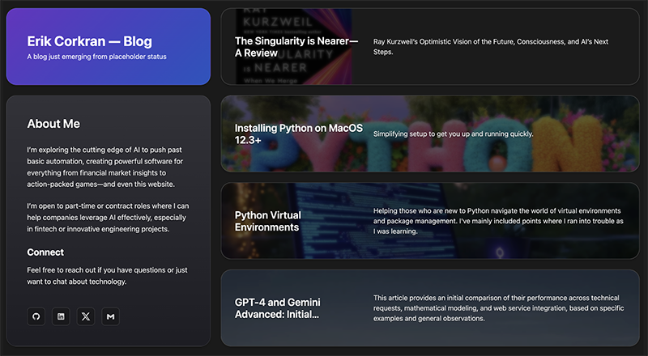
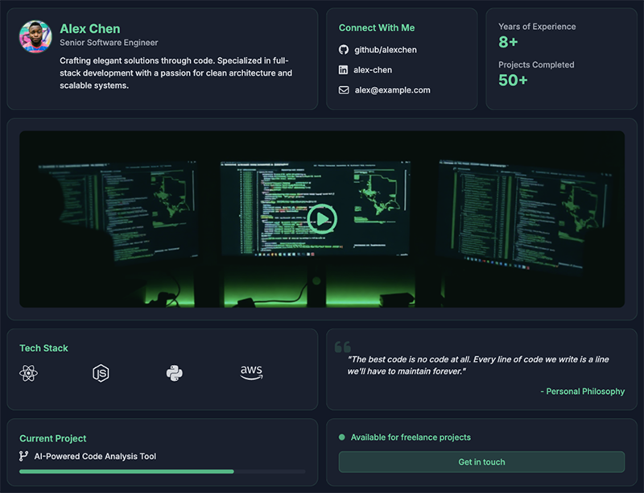
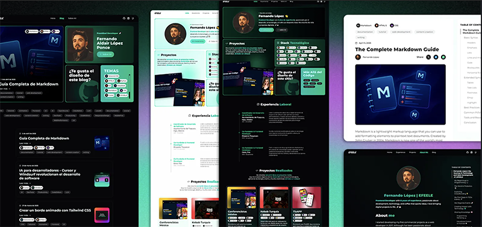
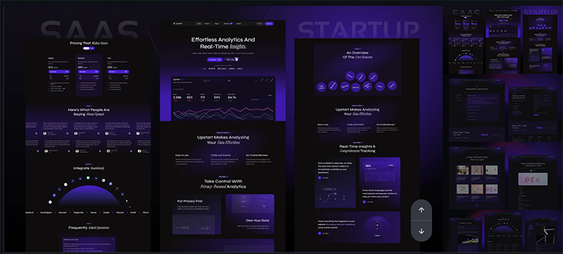
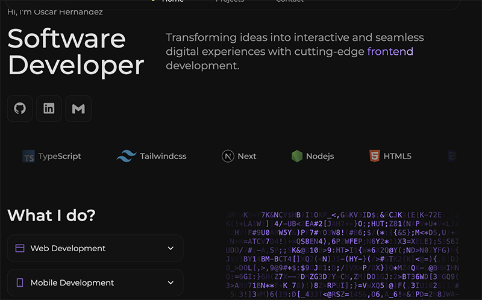
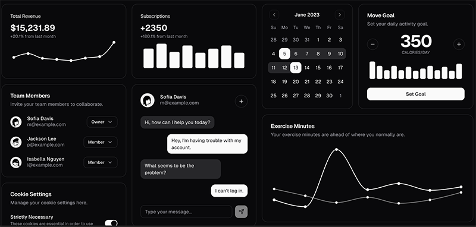
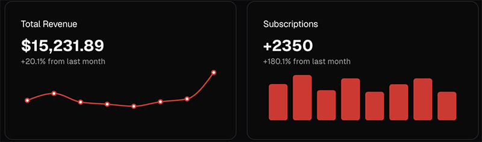

#### Overview

We are going to update my personal website erikcorkran.com. This site is a central part of personal and professional branding for me.

#### Existing Site

The existing site is online at https://erikcorkran.com . Screenshot is included here. Site is made in Astro, in a reactive bento layout, with markdown-driven content.

#### Updates

It's a good basic functional site. We could update it to astro with React islands, but for a few reasons detailed later, we should instead make a new site and then we will port the content (markdown) over.

The new site should support different variations of bento card layouts, and at some point support shuffles or other animations. It should be possible to have bigger/focused/special cards to showcase particular things. Smaller codes with quotes or similar should be supported too. We'll use cards for everything from blog posts to videos to threejs demos. We'll want to start with the core and just placeholders for the later/fancy ones, and build from there.

Let's make it a NextJS app/site. Technical details follow below. Since it's nextjs let's put a dark/light mode selector, and we'll make it look good in both spots.

We're going to want to use Markdown as the content for blog articles. We'll want to re-use those background pics to from the existing site example. I can provide those.

#### Design Inspirations

We should do a good dark and light theme. Ideally something that doesn't look like _everything_ else. With that in mind, here are some design inspirations.

###### Developer Site Mockup

Software developer site mockup I created with https://uxpilot.ai

What I like:

- Nice and slightly unusual blend of dark-mode colors.
- Variety of card shapes and sizes, including a video focus card.
- Has quote, readable.

What I would change:

- It feels too "flat" maybe
- The Tech Stack card I don't love. The spacing looks "off" and I'd rather have something animated.
- Current project card I would replace with other things.
- The Available/Get in touch isn't my favorite (clunky, something)
- Dark only

Alright so I like that it has a video, some dark variation, and I like green. And quotes.

##### Neon Mint

https://astro.build/themes/details/neonmint/

Great name, many pretty colors, too vivid for this site, then maybe not. I know manta = vibrant, polygon = professional but energizing and confidence inspiring. erikcorkran = i haven't quite decided yet.

###### Deep Purple

Bold but maybe with a different color, blues and greens instead of the purple, but I like the use of color for well, whatever you call this.

##### Developer Preview

https://oscarhernandez.vercel.app/

Great focused site. The techs section looks nice -- WAY better than others so far, and its animated/ticker scrolling. The ASCII animation is cool too, and the contact icons are clean and functional. It doesn't use obvious cards, but it's a nice site.

I have seen techs done in a spherical-appearing tag-cloud but now I cannot find an example of this. Hmm. All the spherical ones I can find are terrible. We'll make our own later.

###### ShadCN

ShadCN blocks look great. We'll want to theme and potentially customize of course.

Portion of above example themed.

#### Technology Stack

##### Overview

Let's plan to create this s a new NextJS app. We will use Tailwind and ShadCN. We'll need something for animation (probably Framer, and it seems like code rules support this). We'll want to support ThreeJS and R3F.

No auth is needed at least initially. Deployment will be to Vercel. No scaling issues are foreseen as this is just my personal website as an anchor of my "brand".

It needs to be great. I want it professional but not some lame corporate-conforming boring resume site. Yes sure I want links to all my stuff, resume too, reasonable personal info, and some stuff about projects and skills. I'll want to include some of my recreation/adventures as well.

We need ThreeJS, R3F, video, it needs to be bold but not obnoxious. Dark mode with some green even some matrix green, mint, something like that. In light mode rich greens, teals.

##### Comparing Astro + React to rebuild on NextJS 14

The following table is a comparison created by an AI team member evaluating whether we should keep this site in Astro but add React "islands", or rebuild it on NextJS 14 then migrate content. It indicates net advantage of moving to NextJS 14. "**Gut-check:** From everything you’ve said—dynamic “Latest Loom” cards, r3f demos, server-side contact forms, shared visual identity across sites—**Next .js 14 + shadcn** will remove more friction than it adds."

| **Criterion**                                                               | **Stay on Astro** **– drop React “islands”**                                                                                | **Rebuild on Next.js 14** **(+ shadcn-ui)**                                                              |
| --------------------------------------------------------------------------- | --------------------------------------------------------------------------------------------------------------------------- | -------------------------------------------------------------------------------------------------------- |
| **What you already have**                                                   | ✔ Site is alive, SEO-indexed, build setup known.✔ Zero/low JavaScript for pure-blog pages = lightning fast.               | ✘ Start from scratch (copy Markdown + images).                                                           |
| **Adding React/Three.js**                                                   | Use <Island client:load> or <FrameworkLoader /> to hydrate only the r3f section.Ideal for _1-2 gizmos_ per page.            | Everything is React by default, so r3f, dynamic cards, and shadcn just drop in.                          |
| **shadcn-ui compatibility**                                                 | Community port exists, but fewer components & no Server Components / async actions. Extra plumbing for theme/tailwind sync. | First-class: npx shadcn-ui scaffolds cards, modal, contact form, **Server Actions** work out of the box. |
| **Future dynamic needs**(contact form, lead DB, gated course content, auth) | Need Astro API routes (okay) or external functions. More mental switching between “static” and “dynamic” zones.             | Next = full-stack. Server Actions, Route Handlers, Auth.js already documented with shadcn examples.      |
| **Cross-site re-use**(manta.digital, polygonsolutions.net)                  | Must repeat Astro+React config for each repo or learn Astro multi-site workspace.                                           | One shared UI kit & Tailwind config; copy/paste pages and deploy.                                        |
| **Learning & portfolio value**                                              | Shows polyglot chops (Astro + React islands).                                                                               | Shows mastery of the most demanded React meta-framework (good for clients & recruiters).                 |
| **Performance**                                                             | Slightly leaner if most pages stay static.                                                                                  | Still excellent via static + RSC streaming, just omit heavy client libs.                                 |
| **Migration effort**                                                        | - Add React & shadcn port- Refactor MD → MDX for interactive bits- Tweak build for image imports                            | - Scaffold Next app- Copy Markdown- Install contentlayer / next-mdx- Re-add styling tokens               |

#### Additional Resources

ShadCN Resources:

- Main ShadCN Themes: https://ui.shadcn.com/themes
- Blocks and Blocks: https://ui.shadcn.com/blocks
- Basic Charts: https://ui.shadcn.com/charts
- Radix Primitives: https://www.radix-ui.com/
- Collection of links and resources: https://github.com/birobirobiro/awesome-shadcn-ui
